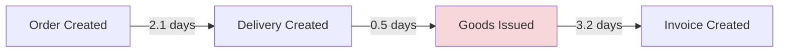

# SAP Transaction Forensics

> Forensic pattern discovery for ERP transaction data. Not a rule engine — a learning system.

## The Problem

Existing forensic tools ship with hardcoded rules. "Flag invoices over $X." "Alert on vendor master changes." These rules miss new patterns and fire on irrelevant ones. Every ERP is different. Every client's fraud signature is different. A static rule engine cannot keep up.

## The Approach

This project has two layers:

1. **Detection layer** — 23 MCP tools implementing well-known forensic checks (SoD conflicts, conformance deviations, journal anomalies, reality gaps). Deterministic, tested, callable from Claude Code.
2. **Discovery layer** — a Worker/Critic/Ralph loop that proposes *new* patterns from your data, validates them against evidence, and grows a persistent pattern library. See [pattern-discovery/](pattern-discovery/).

The detection layer finds things you know to look for. The discovery layer finds things you didn't.

## Try It in 60 Seconds

No SAP access required. Synthetic data included.

```bash
git clone https://github.com/chrbailey/SAP-Transaction-Forensics.git
cd SAP-Transaction-Forensics
make demo                              # generates synthetic data + runs analysis
cd mcp-server && npm install && npm run build && cd ..
claude                                 # opens Claude Code with 18 forensic tools wired up
```

Then ask Claude: *"Run a conformance check against the o2c-simple reference model."*

Full walkthrough: **[QUICKSTART.md](QUICKSTART.md)** · Five-question demo: **[scripts/demo-walkthrough.md](scripts/demo-walkthrough.md)** · Pattern discovery: **[pattern-discovery/README.md](pattern-discovery/README.md)**

## What This Is Not

- **Not a governance tool.** For pre-execution approval of AI agent actions, see [PromptSpeak](https://github.com/chrbailey/promptspeak-mcp-server).
- **Not a self-healing system.** It finds problems. Humans decide what to do.
- **Not a commercial product.** MIT licensed. Built by an independent consultant (Christopher Bailey, ERP Access Inc, 29 years in ERP — SAP, NetSuite, Oracle, Workday).

---

[](https://opensource.org/licenses/MIT)
[](https://nodejs.org/)
[](https://www.python.org/)
[](https://github.com/chrbailey/SAP-Transaction-Forensics)
[](https://github.com/chrbailey/SAP-Transaction-Forensics)

---

## What's New: Evidence Infrastructure

Full evidence lifecycle from extraction through reviewer handoff, with cryptographic verification at every step.

| Feature | Description |
|---------|-------------|
| **Provenance Graph** | Field-level DAG tracing every finding to system/table/record/field/value/timestamp |
| **Extraction Registry** | 19 named, versioned, deterministic extraction paths across SAP, Salesforce, and NetSuite |
| **Contradiction Engine** | 12-category typed taxonomy with risk scoring and type-specific weights |
| **Schema Validator** | 19-table IDES reference schema (438 fields) with pre-flight validation and customization detection |
| **Reality-Gap Detector** | Three-way gap analysis: reference models vs documented business rules vs actual event logs |
| **Finding Lifecycle** | 8-state machine with SQLite persistence, transition history, and deduplication |
| **Reviewer Handoff** | Self-contained audit artifacts verifiable without model access |
| **1,639 Tests** | 70 test suites, zero regressions |

### Sample Evidence Chain

```
Finding: AMOUNT_DIVERGENCE on Sales Order 0000045123
  Evidence:
    Left:  SAP.VBAK.0000045123.NETWR = 125,000.00  (extracted 2025-09-15T14:22:00Z)
    Right: SFDC.Opportunity.006R00000123.Amount = 118,750.00  (extracted 2025-09-15T14:22:01Z)
    Delta: 5.3% ($6,250.00)
  Provenance:
    Extraction Path: sap-o2c-order-headers v1.0
    Replay Hash: sha256:a7f3b2...
  State: CONFIRMED → REMEDIATION (transitioned 2025-09-16 by reviewer@corp.com)
```

---

## Alternative Paths (Without Claude Code)

If you're not using Claude Code, the underlying tools can still be run directly:

### Option A: Docker Compose (Browser UI)
```bash
docker-compose up --build
# Open browser to http://localhost:8080
```

### Option B: Analyze Your CSV Exports
```bash
# Export from SE16: VBAK, VBAP, LIKP, LIPS, VBRK, VBRP, STXH/STXL
# Place files in ./input-data/
docker-compose run pattern-engine --input-dir /app/input-data --output-dir /app/output
```

### Option C: Live RFC Connection
```bash
# Copy and edit configuration
cp .env.rfc.example .env.rfc
# Edit .env.rfc with your SAP connection details

# Run with RFC adapter
docker-compose --profile rfc up mcp-server-rfc
```

See [Installation Guide](docs/adapter_guide.md) for detailed setup instructions.

### Option D: Analyze Salesforce Data
```bash
# 1. Generate synthetic SFDC data (200 Opportunities, 10 planted anomaly patterns)
cd synthetic-data
python3 src/generate_sfdc.py --count 200 --accounts 50 --output sfdc_output/ --seed 42

# 2. Run the forensic analysis
cd ../pattern-engine
python3 pattern-engine/scripts/analyze_sfdc.py

# Or bring your own SFDC export:
# Place Opportunity, Account, StageHistory CSVs in ./data/sfdc/
# python3 pattern-engine/scripts/analyze_sfdc.py --data-dir ../data/sfdc
```

---

## Evidence Infrastructure

The evidence infrastructure provides a complete chain of custody from raw system data through forensic findings to reviewer-ready audit packets.

### Provenance Graph

Every finding traces back to specific fields in specific records in specific systems through a directed acyclic graph (DAG). Each extraction record captures:

- **System** - SAP, Salesforce, or NetSuite
- **Table** - Source table (e.g., VBAK, Opportunity)
- **Record ID** - Specific document or record
- **Field** - Individual field name
- **Value** - Extracted value at time of extraction
- **Timestamp** - When the extraction occurred
- **Replay Hash** - SHA-256 hash for independent re-verification

Export formats: DAG JSON (full graph), flat (tabular), Markdown (human-readable).

### Extraction Registry

19 named, versioned, deterministic extraction paths ensure reproducible data collection:

| Domain | Path | Description |
|--------|------|-------------|
| **SAP O2C** | `sap-o2c-order-headers` | Sales order header fields (VBAK) |
| | `sap-o2c-order-items` | Line item details (VBAP) |
| | `sap-o2c-doc-flow` | Document flow chain (VBFA) |
| | `sap-o2c-delivery-timing` | Requested vs actual delivery (LIKP/LIPS) |
| | `sap-o2c-invoice-timing` | Invoice creation and posting (VBRK/VBRP) |
| **SAP FI/CO** | `sap-fico-journal-entries` | Journal entry headers (BKPF) |
| | `sap-fico-line-items` | Journal line items (BSEG) |
| | `sap-fico-sod-conflicts` | Segregation of duties analysis |
| | `sap-fico-gl-balances` | GL account balances |
| **SAP P2P** | `sap-p2p-purchase-orders` | Purchase order data (EKKO/EKPO) |
| | `sap-p2p-requisitions` | Purchase requisitions (EBAN) |
| | `sap-p2p-goods-receipts` | Goods receipt documents (MKPF/MSEG) |
| | `sap-p2p-invoice-verification` | Invoice verification (RBKP/RSEG) |
| **Salesforce** | `sfdc-opportunities` | Opportunity pipeline data |
| | `sfdc-stage-history` | Stage transition history |
| | `sfdc-activities` | Tasks and events on records |
| **NetSuite** | `netsuite-user-activity` | User activity audit trail |
| | `netsuite-transaction-summary` | Transaction summaries |
| | `netsuite-login-history` | Login and access history |

Each path is versioned and produces deterministic output for the same input, enabling SHA-256 replay verification.

### Contradiction Engine

Cross-system contradiction detection with a 12-category typed taxonomy:

| Category | What It Detects |
|----------|----------------|
| `AMOUNT_DIVERGENCE` | Dollar amounts that differ beyond tolerance across systems |
| `DATE_CONFLICT` | Dates that disagree between matched records |
| `STATUS_INCOMPATIBLE` | Status fields that cannot logically coexist |
| `ENTITY_MISMATCH` | Customer/vendor/material IDs that do not match across systems |
| `QUANTITY_DIVERGENCE` | Quantities that differ beyond tolerance |
| `APPROVAL_BYPASS` | Transactions that bypassed required approval steps |
| `TEMPORAL_IMPOSSIBILITY` | Events that occur in an impossible sequence |
| `DUPLICATE_REFERENCE` | Multiple records claiming the same reference number |
| `ORPHAN_RECORD` | Records in one system with no counterpart in the other |
| `RETROACTIVE_CHANGE` | Changes made to records after they were finalized |
| `SOD_VIOLATION` | Same user performing conflicting duties |
| `SCHEMA_GHOST` | Fields or values that reference non-existent schema elements |

Risk scoring uses type-specific weights. Severity levels: CRITICAL, HIGH, MEDIUM, LOW, INFO.

### Schema Validator

Pre-flight validation of extraction paths against client schemas before any data is pulled.

- **Reference schema**: 19 tables, 438 fields from an actual SAP IDES dump
- **Path validation**: Verifies that every field referenced by an extraction path exists in the client schema
- **Customization detection**: Identifies Z-tables, Z-fields, and custom namespaces
- **Gap reporting**: Shows exactly which fields are missing and which paths are affected

### Reality-Gap Detector

Three-way gap analysis comparing what should happen, what is documented, and what actually happens:

| Gap Type | Comparison | Example |
|----------|-----------|---------|
| **Design Gap** | Reference model vs documented rules | SoD policy exists but no enforcing control configured |
| **Compliance Gap** | Documented rules vs actual events | Three-way match required but invoices posted without GR |
| **Shadow Process** | Actual events vs all documented models | Goods receipts posted on weekends with no approval workflow |

Includes a rule parser with standard rulesets for SAP, NetSuite, and Salesforce.

### Finding Lifecycle Manager

8-state machine tracking every finding from detection through resolution:

```
DETECTED → TRIAGED → INVESTIGATING → CONFIRMED → REMEDIATION → RESOLVED
                 ↘                       ↘              ↗
              FALSE_POSITIVE         ACCEPTED_RISK
```

- SQLite persistence with full transition history (who, when, from-state, to-state)
- Deduplication prevents the same finding from being logged twice
- Four finding sources: contradiction, reality_gap, conformance, fi_co_anomaly
- Risk scores (0.0-1.0) computed from finding type and severity

### Reviewer Handoff Packets

Self-contained audit artifacts that can be verified without model access:

- **Executive Summary** - Scope, systems analyzed, key metrics, risk distribution
- **Rendered Findings** - Each finding with severity, evidence tables, and provenance chain
- **Extraction Manifest** - Every extraction path used, with parameters and SHA-256 replay hashes
- **Reproduction README** - Step-by-step instructions to re-run the analysis independently
- **Reviewer Checklist** - 25-item verification checklist covering completeness, accuracy, and methodology

---

## SFDC Forensic Analysis

The Salesforce adapter maps Opportunity pipeline data through the same pattern engine used for SAP:

### Field Mapping (SFDC → SAP Normalized)

| SFDC Concept | SAP Equivalent | Mapping |
|---|---|---|
| Opportunity.Id | VBELN | Padded to 10 chars |
| RecordType.Name | AUART | New Business→ZNEW, Renewal→ZREN, Upsell→ZUPS |
| Account.Id | KUNNR | Padded to 10 chars |
| Opportunity.Amount | NETWR | Direct |
| Stage transitions | VBFA (doc flow) | Each stage change → flow entry |
| Task/Event | STXH/STXL (texts) | Activity subject + description → doc text |
| Account (safe fields) | KNA1 | Industry, State, Country only (no PII) |

### Cross-System Correlation

When both SFDC and SAP data are loaded, the entity resolver matches records using:

1. **Explicit ID** (confidence 0.99) — `Opportunity.SAP_Order_Number__c == VBAK.VBELN`
2. **Proximity** (confidence 0.50-0.95) — Account name similarity + amount tolerance + date proximity
3. **Temporal sequence** (Phase 2) — Monotonic SFDC→SAP event chain validation

Anomalies detected across matched pairs:
- **Timing gaps** — SFDC close to SAP order creation > 30 days
- **Amount discrepancies** — SFDC Amount vs SAP NETWR > 5% tolerance
- **Sequence violations** — SAP order created before SFDC close
- **Missing handoffs** — SFDC Closed Won with no corresponding SAP order

### Planted Anomaly Patterns (Synthetic Data)

The SFDC generator plants 10 detectable patterns at controlled rates:

| Pattern | Rate | What It Tests |
|---|---|---|
| Stage skip | 5% | Conformance: mandatory stages bypassed |
| Quarter-end compression | 40% of won | Temporal: period-end deal clustering |
| Ghost pipeline | 10% of late-stage | Correlation: zero activities on active deals |
| Stage regression | 3% | Conformance: backward stage movement |
| Amount inflation | 8% | Correlation: >50% amount increase at close |
| Split deal | 6% | Cross-entity: same account, duplicate deals within 7 days |
| Speed anomaly | 5% | Temporal: created to closed in <3 days |
| Stale pipeline | 15% of open | Temporal: no movement for >90 days |
| Owner swap at close | 4% of won | Conformance: owner changes in final stage |
| Cross-system gap | 6% of SAP-linked | Cross-system: >30 day SFDC→SAP timing gap |

---

## What You Get

```
+-----------------------------------------------------------------------------------+
|                              Pattern Discovery Report                              |
+-----------------------------------------------------------------------------------+
| Pattern: "Credit Hold Escalation"                                                  |
| ----------------------------------------------------------------------------------|
| Finding: Orders with 'CREDIT HOLD' in notes have 3.2x longer fulfillment cycles   |
|                                                                                    |
| Occurrence: 234 orders (4.7% of dataset)                                           |
| Sales Orgs: 1000 (64%), 2000 (36%)                                                 |
| Confidence: HIGH (p < 0.001)                                                       |
|                                                                                    |
| Caveat: Correlation only - does not imply causation                                |
+-----------------------------------------------------------------------------------+
```

**Key Features:**
- **Text Pattern Discovery** - Find hidden patterns in order notes, rejection reasons, and delivery instructions
- **Document Flow Analysis** - Trace complete order-to-cash chains with timing at each step
- **Outcome Correlation** - Identify text patterns that correlate with delays, partial shipments, or returns
- **Evidence-Based Reporting** - Every pattern links to specific documents with field-level provenance
- **Privacy-First Design** - PII redaction enabled by default, shareable output mode for external review

---

## v2.0 Features

### Natural Language Interface

Ask questions about your SAP processes in plain English:

```
User: "Why are orders from sales org 1000 taking longer to ship?"

System: Based on analysis of 5,234 orders:
- Average delay: 4.2 days vs 1.8 days for other orgs
- Root cause: 73% have "CREDIT HOLD" in notes
- Recommendation: Review credit check thresholds for org 1000

Confidence: HIGH | Evidence: 847 documents analyzed
```

Supports multiple LLM providers:
- **Ollama** (local, private) - Default for air-gapped environments
- **OpenAI** (GPT-4) - For cloud deployments
- **Anthropic** (Claude) - Alternative cloud option

### OCEL 2.0 Export

Export to the [Object-Centric Event Log](https://www.ocel-standard.org/) standard for advanced process mining:

```json
{
  "ocel:version": "2.0",
  "ocel:objectTypes": ["order", "item", "delivery", "invoice"],
  "ocel:events": [...],
  "ocel:objects": [...]
}
```

- Captures multi-object relationships (order → items → deliveries → invoices)
- Compatible with PM4Py, Celonis, and other OCEL tools
- Export formats: JSON, XML, SQLite

### Conformance Checking

Compare actual SAP processes against expected Order-to-Cash models:

```
Conformance Report: 94.2% (4,712 / 5,000 cases)

Deviations Detected:
├── CRITICAL: Invoice before Goods Issue (23 cases)
├── MAJOR: Skipped Delivery step (187 cases)
└── MINOR: Duplicate Order Created (78 cases)
```

- Pre-built O2C reference models (simple and detailed)
- Severity scoring: Critical / Major / Minor
- Deviation types: skipped steps, wrong order, missing activities

### Visual Process Maps

Generate process flow diagrams with bottleneck highlighting:



- Output formats: Mermaid (Markdown), GraphViz (DOT), SVG
- Color-coded bottleneck severity (green/yellow/red)
- Timing annotations between process steps

### Predictive Monitoring

ML-based prediction for process outcomes:

```
Order 0000012345 - Risk Assessment:
├── Late Delivery: 78% probability (HIGH RISK)
│   └── Factors: credit_block, order_value > $50k
├── Credit Hold: 45% probability (MEDIUM RISK)
└── Est. Completion: 8.2 days
```

**Prediction Types:**
- **Late Delivery** - Probability based on case age, progress, stalls, rework
- **Credit Hold** - Likelihood based on credit check status, complexity
- **Completion Time** - Estimated hours remaining based on progress/pace

**29 Extracted Features:**
- Temporal: case age, time since last event, avg time between events
- Activity: milestones reached, rework detection, loop count, backtracks
- Resource: unique resources, handoff count
- Risk indicators: stalled cases, credit holds, rejections, blocks

---

## Why This Instead of S/4HANA?

| Consideration | S/4HANA Migration | Transaction Forensics |
|--------------|-------------------|---------------------|
| **Timeline** | 18-36 months | Hours to first insights |
| **Cost** | $10M-$100M+ | Free (MIT license) |
| **Risk** | Business disruption | Zero - read-only access |
| **Data Location** | Cloud/hosted | On-premise only |
| **Prerequisites** | Greenfield/brownfield project | Works with existing ECC 6.0 |
| **Process Visibility** | After migration | Before any changes |
| **Use Case** | Full transformation | Process discovery & optimization |

**This tool does not replace S/4HANA.** It helps you understand your current processes *before* making migration decisions - or find optimization opportunities in your existing ECC system.

---

## Installation

### Prerequisites
- Docker & Docker Compose (recommended)
- OR Node.js 18+ and Python 3.10+ for local development

### Quick Install
```bash
git clone https://github.com/chrbailey/SAP-Transaction-Forensics.git
cd transaction-forensics
docker-compose up --build
```

### Detailed Setup
See [docs/adapter_guide.md](docs/adapter_guide.md) for:
- RFC adapter configuration for ECC 6.0
- OData adapter configuration for S/4HANA
- CSV import from SE16 exports
- Air-gapped installation options

### LLM Configuration (v2.0)

Configure the natural language interface in `.env`:

```bash
# Option 1: Local Ollama (default, private)
LLM_PROVIDER=ollama
OLLAMA_HOST=http://localhost:11434
LLM_MODEL=llama3

# Option 2: OpenAI
LLM_PROVIDER=openai
LLM_API_KEY=<YOUR_OPENAI_KEY>
LLM_MODEL=gpt-4

# Option 3: Anthropic
LLM_PROVIDER=anthropic
LLM_API_KEY=<YOUR_ANTHROPIC_KEY>
LLM_MODEL=claude-3-sonnet-20240229
```

For air-gapped environments, use Ollama with locally downloaded models.

---

## Demos

Interactive demos for all v2.0 process mining tools. No SAP connection required - all demos use synthetic data.

```bash
cd mcp-server

# Natural Language Interface - ask questions in plain English
npx tsx ../demos/ask_process_demo.ts
npx tsx ../demos/ask_process_demo.ts --interactive  # Interactive mode

# OCEL 2.0 Export - export to process mining standard format
npx tsx ../demos/export_ocel_demo.ts

# Conformance Checking - compare against O2C reference model
npx tsx ../demos/check_conformance_demo.ts

# Visual Process Maps - generate Mermaid flowcharts
npx tsx ../demos/visualize_process_demo.ts

# Predictive Monitoring - ML-based risk predictions
npx tsx ../demos/predict_outcome_demo.ts
```

| Demo | Description |
|------|-------------|
| `ask_process_demo.ts` | Natural language queries with LLM integration |
| `export_ocel_demo.ts` | OCEL 2.0 export with object/event breakdown |
| `check_conformance_demo.ts` | Deviation detection and severity scoring |
| `visualize_process_demo.ts` | Mermaid diagrams with bottleneck highlighting |
| `predict_outcome_demo.ts` | Risk predictions and alerts |
| `salt_adapter_demo.ts` | Real SAP O2C data from SALT dataset |
| `visualize_process_bpi_demo.ts` | Process maps with real P2P data (BPI 2019) |
| `predict_outcome_bpi_demo.ts` | Risk predictions with real P2P data (BPI 2019) |
| `ask_process_bpi_demo.ts` | Natural language queries on P2P data |

---

## Real SAP Data

### BPI Challenge 2019 (P2P)

Use real SAP Purchase-to-Pay data from the [BPI Challenge 2019](https://data.4tu.nl/articles/dataset/BPI_Challenge_2019/12715853) for testing with authentic business patterns.

```bash
# Download and convert BPI 2019 data
python scripts/convert-bpi-xes.py

# Run demos with real P2P data
npx tsx demos/visualize_process_bpi_demo.ts 50
npx tsx demos/predict_outcome_bpi_demo.ts 30
npx tsx demos/ask_process_bpi_demo.ts
```

**Dataset Statistics:**
| Metric | Value |
|--------|-------|
| Total cases | 251,734 |
| Total events | 1.5M+ |
| Unique activities | 39 |
| Process type | Purchase-to-Pay (P2P) |
| Source | Multinational coatings company |

**Activities include:** SRM workflows, Purchase Orders, Goods Receipts, Service Entries, Invoice Processing, Vendor interactions

---

### SALT Dataset (O2C)

Use real SAP ERP data from SAP's [SALT dataset](https://huggingface.co/datasets/SAP/SALT) on HuggingFace for testing with authentic business patterns.

### Quick Start

```bash
# 1. Install Python dependencies
pip install datasets pyarrow

# 2. Download SALT dataset
python scripts/download-salt.py

# 3. Run demo with real data
cd mcp-server
npx tsx ../demos/salt_adapter_demo.ts
```

### What's Included

SALT (Sales Autocompletion Linked Business Tables) contains:

| Table | Description | Records |
|-------|-------------|---------|
| I_SalesDocument | Sales order headers | ~1M+ |
| I_SalesDocumentItem | Order line items | ~5M+ |
| I_Customer | Customer master data | ~100K |
| I_AddrOrgNamePostalAddress | Address data | ~100K |

### Using the SALT Adapter

```typescript
import { SaltAdapter } from './adapters/salt/index.js';

const adapter = new SaltAdapter({
  maxDocuments: 10000,  // Limit for memory management
});

await adapter.initialize();

// Get real sales order data
const header = await adapter.getSalesDocHeader({ vbeln: '0000012345' });
const items = await adapter.getSalesDocItems({ vbeln: '0000012345' });

// Get dataset statistics
const stats = adapter.getStats();
console.log(`Loaded ${stats.salesDocuments} sales documents`);
```

### Limitations

SALT contains **sales orders only** (no deliveries or invoices). For full Order-to-Cash testing:
- Use SALT for sales order analysis and ML training
- Use synthetic adapter for complete O2C flow testing
- Combine both for comprehensive validation

### Why Use Real Data?

| Aspect | Synthetic Data | SALT Real Data |
|--------|---------------|----------------|
| Patterns | Random/artificial | Authentic business patterns |
| ML Training | Limited accuracy | Real-world feature distributions |
| Demos | Good for UI testing | Compelling for stakeholders |
| Validation | Functional testing | Business logic validation |

### Analysis Results

We've validated the MCP tools against real SAP datasets. View the detailed analysis:

| Dataset | System | Cases | Events | Key Findings | Report |
|---------|--------|-------|--------|--------------|--------|
| **SFDC Synthetic** | Salesforce | 214 | 2,417 | 10 anomaly patterns, 57% QE compression, 2 cross-system gaps | Run: `python3 pattern-engine/scripts/analyze_sfdc.py` |
| **BPI Challenge 2019** | SAP P2P | 251,734 | 1.6M | 42 activities, 64-day median throughput | [View →](docs/analysis/bpi-challenge-2019.md) |
| **SAP IDES O2C** | SAP O2C | 646 | 5,708 | 158 variants, bottlenecks identified | [View →](docs/analysis/order-to-cash.md) |
| **SAP IDES P2P** | SAP P2P | 2,486 | 7,420 | 7 compliance violations detected | [View →](docs/analysis/procure-to-pay.md) |

**Process Diagrams**: [Mermaid flowcharts for O2C and P2P](docs/analysis/process-diagrams.md)

**Test Suite**: 1,639 tests passing across 70 test suites (TypeScript + Python)

---

## Security & Compliance

**This system is designed for enterprise security requirements.**

| Concern | How We Address It |
|---------|-------------------|
| **Data Access** | Read-only BAPIs only - no write operations, no arbitrary SQL |
| **Data Location** | All processing is on-premise - no cloud, no external APIs |
| **Network** | No outbound connections, no telemetry, no phone-home |
| **PII Protection** | Automatic redaction of emails, phones, names, addresses |
| **Audit Trail** | Every query logged with parameters, timestamps, row counts |
| **Row Limits** | Default 200 rows per query, max 1000 - prevents bulk extraction |
| **Provenance** | SHA-256 replay hashing on every extraction for independent verification |
| **Handoff Integrity** | Reviewer packets are self-contained and verifiable without model access |

**See [SECURITY.md](SECURITY.md) for complete security documentation.**

---

## For SAP Basis Administrators

### Required Authorizations

The RFC user requires **display-only** access to SD documents:

```
Authorization Object: S_RFC
  RFC_TYPE = FUGR
  RFC_NAME = STXR, 2001, 2051, 2056, 2074, 2077
  ACTVT = 16 (Execute)

Authorization Object: V_VBAK_VKO
  VKORG = [Your Sales Organizations]
  ACTVT = 03 (Display)

Authorization Object: V_VBAK_AAT
  AUART = * (or specific document types)
  ACTVT = 03 (Display)
```

**Copy-paste ready role template:** See [docs/SAP_AUTHORIZATION.md](docs/SAP_AUTHORIZATION.md)

### BAPIs Used (All Read-Only)

| BAPI | Purpose | Tables Accessed |
|------|---------|-----------------|
| `BAPI_SALESORDER_GETLIST` | List sales orders | VBAK |
| `SD_SALESDOCUMENT_READ` | Read order header/items | VBAK, VBAP |
| `BAPI_SALESDOCU_GETRELATIONS` | Document flow (VBFA) | VBFA |
| `BAPI_OUTB_DELIVERY_GET_DETAIL` | Delivery details | LIKP, LIPS |
| `BAPI_BILLINGDOC_GETDETAIL` | Invoice details | VBRK, VBRP |
| `READ_TEXT` | Long text fields | STXH, STXL |
| `BAPI_CUSTOMER_GETDETAIL2` | Customer master (stub) | KNA1 |
| `BAPI_MATERIAL_GET_DETAIL` | Material master (stub) | MARA |

No direct table access. No RFC_READ_TABLE unless explicitly enabled.

---

## Architecture

```
+------------------------------------------------------------------+
|                        Your Network                               |
|  +------------------------------------------------------------+  |
|  |                                                            |  |
|  |   +----------------+     +-------------------+             |  |
|  |   | SAP ECC 6.0    |     | SAP Workflow      |             |  |
|  |   |                |     | Mining Server     |             |  |
|  |   |  +----------+  |     |                   |             |  |
|  |   |  | SD/MM    |  | RFC |  +-------------+  |             |  |
|  |   |  | Tables   |<--------->| MCP Server  |  |             |  |
|  |   |  +----------+  | (R/O)|  +-------------+  |             |  |
|  |   |                |     |         |         |             |  |
|  |   +----------------+     |         v         |             |  |
|  |                          |  +-------------+  |             |  |
|  |   +----------------+     |  | Evidence    |  |             |  |
|  |   | Salesforce     |     |  | Engine      |  |             |  |
|  |   |                | API |  | +---------+ |  |             |  |
|  |   | Opportunities  |<------>| |Provnance| |  |             |  |
|  |   | Activities     |     |  | |Registry | |  |             |  |
|  |   +----------------+     |  | |Findings | |  |             |  |
|  |                          |  | +---------+ |  |             |  |
|  |   +----------------+     |  +-------------+  |             |  |
|  |   | NetSuite       |     |         |         |             |  |
|  |   |                | API |         v         |             |  |
|  |   | Users/Txns     |<--->|  +-------------+  |             |  |
|  |   +----------------+     |  | Pattern     |  |             |  |
|  |                          |  | Engine      |  |             |  |
|  |                          |  +-------------+  |             |  |
|  |                          |         |         |             |  |
|  |   +----------------+     |  +-------------+  |             |  |
|  |   | Browser        |<------>| Web Viewer  |  |             |  |
|  |   | (localhost)    |     |  +-------------+  |             |  |
|  |   +----------------+     +-------------------+             |  |
|  |                                                            |  |
|  +------------------------------------------------------------+  |
|                                                                   |
|                    NO EXTERNAL CONNECTIONS                        |
+------------------------------------------------------------------+
```

**Data Flow:**
1. MCP Server connects to SAP via RFC, Salesforce via API, NetSuite via API (all read-only)
2. Extraction Registry executes named, versioned extraction paths
3. Provenance Graph records field-level evidence for every extraction
4. Contradiction Engine and Reality-Gap Detector analyze cross-system data
5. Finding Lifecycle Manager tracks findings from detection through resolution
6. Handoff Generator produces self-contained reviewer packets
7. Web Viewer displays findings on localhost

**Nothing leaves your network.**

---

## FAQ

### Is this tool officially supported by SAP?

No. This is an independent open-source project. It uses standard SAP BAPIs that are publicly documented.

### Will this impact SAP system performance?

Minimal impact. All queries are:
- Read-only (no locks)
- Row-limited (200 default, 1000 max)
- Rate-limited (configurable)
- Use standard BAPIs (not direct table access)

We recommend running initial analysis during off-peak hours.

### What SAP modules are supported?

SD (Sales & Distribution), MM (Materials Management), and FI/CO (Financial Accounting / Controlling) document flows. Cross-system analysis with Salesforce CRM and NetSuite is also supported.

### Does this work with SAP on any database?

Yes. The tool uses BAPIs which are database-agnostic. Works with HANA, Oracle, DB2, SQL Server, MaxDB.

### Can I run this in an air-gapped environment?

Yes. The Docker images can be built offline and transferred. No external dependencies at runtime.

### How do I validate the findings?

Every finding includes:
- Field-level provenance tracing to system/table/record/field/value/timestamp
- SHA-256 replay hashes for independent re-verification
- Sample document numbers for verification in SAP (VA03, VL03N, VF03)
- Statistical confidence intervals
- Explicit caveats about correlation vs. causation

For formal review, use `generate_handoff_packet` to produce a self-contained audit artifact with a 25-item reviewer checklist.

### What about GDPR/data protection?

- PII redaction is enabled by default
- No data leaves your network
- Shareable mode applies additional redaction
- See [SECURITY.md](SECURITY.md) for compliance considerations

### Can I contribute or request features?

Yes. See [CONTRIBUTING.md](CONTRIBUTING.md) for guidelines. Feature requests via GitHub Issues.

---

## Governance (PromptSpeak Integration)

The MCP server includes a governance layer based on **PromptSpeak symbolic frames** for pre-execution blocking and human-in-the-loop approval workflows.

### Why Governance?

When AI agents access SAP data, you need controls to:
- **Prevent bulk extraction** - Hold requests for large date ranges or row counts
- **Protect sensitive data** - Require approval for searches containing PII patterns
- **Halt rogue agents** - Circuit breaker to immediately stop misbehaving agents
- **Audit everything** - Complete trail of all operations for compliance

### PromptSpeak Frames

Every operation has a symbolic frame indicating mode, domain, action, and entity:

```
Frame: ⊕◐◀α
       │ │ │ └── Entity: α (primary agent)
       │ │ └──── Action: ◀ (retrieve)
       │ └────── Domain: ◐ (operational)
       └──────── Mode: ⊕ (strict)
```

| Symbol | Category | Meaning |
|--------|----------|---------|
| `⊕` | Mode | Strict - exact compliance required |
| `⊘` | Mode | Neutral - standard operation |
| `⊖` | Mode | Flexible - allow interpretation |
| `⊗` | Mode | **Forbidden** - blocks all actions |
| `◊` | Domain | Financial (invoices, values) |
| `◐` | Domain | Operational (orders, deliveries) |
| `◀` | Action | Retrieve data |
| `▲` | Action | Analyze/search |
| `●` | Action | Validate |
| `α` `β` `γ` | Entity | Primary/secondary/tertiary agent |

### Hold Triggers

Operations are automatically held for human approval when:

| Trigger | Threshold | Example |
|---------|-----------|---------|
| Broad date range | >90 days | `date_from: 2024-01-01, date_to: 2024-12-31` |
| High row limit | >500 rows | `limit: 1000` |
| Sensitive patterns | SSN, credit card, password | `pattern: "social security"` |

### Governance Workflow

```
Agent Request
     │
     ▼
┌─────────────┐     ┌─────────────┐
│ Circuit     │────▶│ BLOCKED     │ (if agent halted)
│ Breaker     │     └─────────────┘
└─────────────┘
     │ OK
     ▼
┌─────────────┐     ┌─────────────┐
│ Frame       │────▶│ BLOCKED     │ (if ⊗ forbidden)
│ Validation  │     └─────────────┘
└─────────────┘
     │ OK
     ▼
┌─────────────┐     ┌─────────────┐     ┌─────────────┐
│ Hold        │────▶│ HELD        │────▶│ Human       │
│ Check       │     │ (pending)   │     │ Approval    │
└─────────────┘     └─────────────┘     └─────────────┘
     │ OK                                      │
     ▼                                         ▼
┌─────────────┐                         ┌─────────────┐
│ EXECUTE     │◀────────────────────────│ APPROVED    │
└─────────────┘                         └─────────────┘
```

### Governance Tools

| Tool | Purpose |
|------|---------|
| `ps_precheck` | Dry-run: check if operation would be allowed |
| `ps_list_holds` | List pending holds awaiting approval |
| `ps_approve_hold` | Approve a held operation |
| `ps_reject_hold` | Reject a held operation with reason |
| `ps_agent_status` | Check circuit breaker state for an agent |
| `ps_halt_agent` | Immediately halt an agent (blocks all ops) |
| `ps_resume_agent` | Resume a halted agent |
| `ps_stats` | Get governance statistics |
| `ps_frame_docs` | Get PromptSpeak frame reference |

### Example: Hold and Approval Flow

```typescript
// 1. Agent makes a request that triggers hold
const result = await mcp.callTool('search_doc_text', {
  pattern: 'delivery',
  date_from: '2024-01-01',
  date_to: '2024-12-31',  // >90 days triggers hold
});
// Returns: { held: true, hold_id: 'hold_abc123', reason: 'broad_date_range' }

// 2. Supervisor reviews pending holds
const holds = await mcp.callTool('ps_list_holds', {});
// Returns: [{ holdId: 'hold_abc123', tool: 'search_doc_text', severity: 'medium' }]

// 3. Supervisor approves
const approved = await mcp.callTool('ps_approve_hold', {
  hold_id: 'hold_abc123',
  approved_by: 'supervisor@example.com'
});
// Returns: { allowed: true, auditId: 'audit_xyz789' }
```

### Example: Emergency Agent Halt

```typescript
// Immediately block a misbehaving agent
await mcp.callTool('ps_halt_agent', {
  agent_id: 'agent-123',
  reason: 'Excessive query rate detected'
});

// All subsequent requests from this agent are blocked
const result = await mcp.callTool('get_doc_text', {
  doc_type: 'order',
  doc_key: '0000000001',
  _agent_id: 'agent-123'  // Identifies the agent
});
// Returns: { error: 'Governance Blocked', message: 'Agent halted: Excessive query rate' }

// Resume when issue is resolved
await mcp.callTool('ps_resume_agent', { agent_id: 'agent-123' });
```

---

## MCP Tools Reference

### SAP Data Tools

| Tool | Purpose | Returns |
|------|---------|---------|
| `search_doc_text` | Find documents by text pattern | doc_type, doc_key, snippet, match_score |
| `get_doc_text` | Get all text fields for a document | header_texts[], item_texts[] |
| `get_doc_flow` | Get order-delivery-invoice chain | chain with keys, statuses, dates |
| `get_sales_doc_header` | Order header details | sales_org, customer, dates, values |
| `get_sales_doc_items` | Order line items | materials, quantities, values |
| `get_delivery_timing` | Requested vs actual delivery | timestamps, variance analysis |
| `get_invoice_timing` | Invoice creation/posting | invoice dates, accounting refs |
| `get_master_stub` | Safe master data attributes | hashed IDs, categories (no PII) |

### Process Mining Tools (v2.0)

| Tool | Purpose | Returns |
|------|---------|---------|
| `ask_process` | Natural language queries | answer, confidence, evidence, recommendations |
| `export_ocel` | Export to OCEL 2.0 format | OCEL JSON/XML with objects and events |
| `check_conformance` | Compare against O2C model | conformance_rate, deviations, severity_summary |
| `visualize_process` | Generate process diagrams | Mermaid/DOT/SVG with bottleneck highlighting |
| `predict_outcome` | ML-based outcome prediction | predictions, alerts, risk_levels, factors |

### FI/CO Forensic Tools

| Tool | Purpose | Returns |
|------|---------|---------|
| `analyze_journal_entries` | Journal entry anomaly detection | anomalies, risk_scores, patterns |
| `analyze_sod` | Segregation of duties analysis | conflicts, violation_count, users |
| `analyze_gl_balances` | GL account balance analysis | balance_anomalies, trends |
| `get_fi_document` | Retrieve FI document details | header, line_items, amounts |
| `generate_fi_assessment` | FI/CO risk assessment report | assessment, findings, recommendations |

### Evidence Infrastructure Tools

| Tool | Purpose | Returns |
|------|---------|---------|
| `query_provenance` | Trace evidence chain for a finding | DAG/flat/Markdown with field-level provenance |
| `list_extraction_paths` | List available extraction paths | path definitions with system, version, fields |
| `run_extraction` | Execute a named extraction path | extracted records with provenance and replay hash |
| `detect_contradictions` | Cross-system contradiction detection | typed contradictions with severity and evidence |
| `validate_schema` | Pre-flight schema validation | path compatibility, missing fields, customizations |
| `analyze_reality_gaps` | Three-way gap analysis | design gaps, compliance gaps, shadow processes |
| `manage_finding` | Create/transition/query findings | finding state, history, risk score |
| `get_finding_summary` | Aggregated finding statistics | counts by state, source, severity, avg risk |
| `generate_handoff_packet` | Produce reviewer handoff packet | executive summary, findings, manifest, checklist |

### Governance Tools

| Tool | Purpose | Returns |
|------|---------|---------|
| `ps_precheck` | Check if operation would be allowed | wouldAllow, wouldHold, reason |
| `ps_list_holds` | List pending holds | Array of hold requests |
| `ps_approve_hold` | Approve a held operation | Execution result with auditId |
| `ps_reject_hold` | Reject a held operation | Success boolean |
| `ps_agent_status` | Get agent circuit breaker state | isAllowed, state, haltReason |
| `ps_halt_agent` | Halt an agent immediately | halted, agent_id |
| `ps_resume_agent` | Resume a halted agent | resumed, agent_id |
| `ps_stats` | Get governance statistics | holds, haltedAgents, auditEntries |
| `ps_frame_docs` | Get PromptSpeak documentation | Frame format reference |

---

## License

MIT License - See [LICENSE](LICENSE)

This is enterprise-friendly open source:
- Use commercially without restriction
- Modify and distribute freely
- No copyleft obligations
- No warranty (provided as-is)

---

## Support

- **Documentation**: [docs/](docs/)
- **Issues**: GitHub Issues
- **Security**: See [SECURITY.md](SECURITY.md) for vulnerability reporting

---

## AI Authorship

This project was built with Claude Code (Anthropic). All commits are co-authored as reflected in git history. The architecture, design decisions, and analysis methodology are the author's; the implementation was pair-programmed with AI assistance.

---

## Disclaimer

This tool is provided as-is for process analysis purposes. It does not modify SAP data. Users are responsible for:
- Ensuring compliance with organizational data access policies
- Validating findings before making business decisions
- Proper configuration of SAP authorizations

**Correlation does not imply causation.** All pattern findings should be verified against actual business processes.
