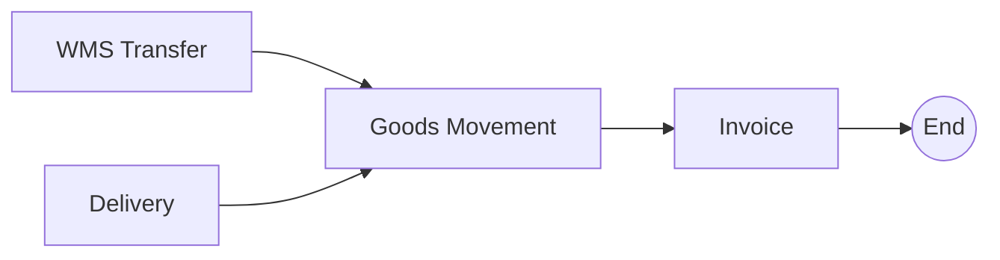

# Order-to-Cash (O2C) Process Mining Analysis

> **Data Attribution**
> Dataset: SAP IDES Demo System Event Log
> Source: [sap-extractor](https://github.com/Agnesvgr96/sap-extractor)
> License: MIT
> Extracted from: VBFA (Document Flow), LIKP (Delivery), VBRK (Billing)

## Executive Summary

This report presents a process mining analysis of the Order-to-Cash (O2C) event log extracted from SAP IDES demo system data. The analysis covers process discovery, bottleneck identification, and anomaly detection.

### Key Metrics

| Metric | Value |
|--------|-------|
| Number of Cases | 646 |
| Number of Events | 5,708 |
| Unique Activities | 8 |
| Average Events per Case | 8.84 |
| Min Case Duration | 0 days |
| Max Case Duration | 6,578 days |
| Median Case Duration | 2.7 days |

---

## 1. Activity Distribution

| Activity | Count | Percentage |
|----------|-------|------------|
| Create Invoice | 1,852 | 32.4% |
| Create Goods movement | 1,834 | 32.1% |
| Create WMS transfer | 1,069 | 18.7% |
| Create Delivery | 916 | 16.0% |
| Cancel Invoice | 19 | 0.3% |
| Delivery (generic) | 9 | 0.2% |
| Create Returns | 5 | 0.1% |
| Create Credit memo | 4 | 0.1% |

### Activity Analysis

The O2C process is dominated by four core activities:
- **Create Invoice** (32.4%) - Financial completion of orders
- **Create Goods movement** (32.1%) - Physical fulfillment tracking
- **Create WMS transfer** (18.7%) - Warehouse management
- **Create Delivery** (16.0%) - Shipping documentation

---

## 2. Process Flow Discovery

### Start Activities

| Activity | Cases | Percentage |
|----------|-------|------------|
| Create WMS transfer | 327 | 50.6% |
| Create Delivery | 271 | 42.0% |
| Create Goods movement | 29 | 4.5% |
| Create Invoice | 19 | 2.9% |

### End Activities

| Activity | Cases | Percentage |
|----------|-------|------------|
| Create Invoice | 540 | 83.6% |
| Create Goods movement | 44 | 6.8% |
| Create WMS transfer | 42 | 6.5% |
| Create Delivery | 17 | 2.6% |
| Cancel Invoice | 3 | 0.5% |

### Main Process Flow

**Primary Flow**: WMS Transfer / Delivery → Goods Movement → Invoice

---

## 3. Directly-Follows Relations

Top activity transitions observed:

| From Activity | To Activity | Count |
|---------------|-------------|-------|
| Create Invoice | Create Invoice | 1,238 |
| Create Goods movement | Create Goods movement | 1,227 |
| Create WMS transfer | Create WMS transfer | 617 |
| Create Goods movement | Create Invoice | 545 |
| Create Delivery | Create Delivery | 523 |
| Create WMS transfer | Create Goods movement | 410 |
| Create Delivery | Create WMS transfer | 293 |
| Create Delivery | Create Goods movement | 205 |

### Key Observations

- **Self-loops are common** (Invoice→Invoice, Goods→Goods) indicating multi-line order processing
- **Main sequential flow**: Delivery/WMS → Goods Movement → Invoice
- **High parallelism** in warehouse activities

---

## 4. Bottleneck Analysis

### Slowest Transitions (Potential Bottlenecks)

| From Activity | To Activity | Occurrences | Avg Duration | Max Duration |
|---------------|-------------|-------------|--------------|--------------|
| Create Invoice | Cancel Invoice | 12 | 17.7 days | 83.1 days |
| Create Invoice | Create Delivery | 14 | 7.7 days | 119.7 days |
| Create WMS transfer | Create WMS transfer | 617 | 3.0 days | 1,510.0 days |
| Create Delivery | Create Goods movement | 205 | 1.7 days | 84.5 days |
| Create WMS transfer | Create Goods movement | 410 | 1.7 days | 84.5 days |
| Create Delivery | Create WMS transfer | 293 | 1.5 days | 87.4 days |

### Bottleneck Insights

1. **Invoice to Cancellation** (17.7 days avg) - Delayed cancellation processing
2. **Invoice to Delivery** (7.7 days) - Reverse flow anomaly (returns/corrections)
3. **WMS Transfer loops** (3.0 days, max 1,510 days) - Warehouse processing delays
4. **Delivery to Goods Movement** (1.7 days) - Fulfillment handoff delays

---

## 5. Anomaly Detection

### Duration Outliers

- **Average case duration**: 29.7 days (std: 356.9)
- **Threshold for outliers**: >743.5 days
- **Cases with unusually long duration**: 2
- **Cases with very short duration**: 0

The 2 outlier cases span data from 1997-2015, indicating demo system test data.

### Activity Repetition (Rework Analysis)

| Activity | Cases with Repeats | Avg Repeats | Max Repeats |
|----------|-------------------|-------------|-------------|
| Create Invoice | 379 | 4.8 | 568 |
| Create Goods movement | 378 | 4.8 | 565 |
| Create WMS transfer | 192 | 5.4 | 545 |
| Create Delivery | 191 | 4.5 | 541 |
| Cancel Invoice | 2 | 4.5 | 5 |

**Note**: High repetition counts (500+) indicate multi-line sales orders where each line generates separate events, not rework.

### Process Variants

- **Total unique process variants**: 158
- **Most common variant coverage**: Top 10 variants cover ~60% of cases

---

## 6. Process Model Description

### Overview

The Order-to-Cash process consists of 8 main activities, processing 646 cases with an average of 8.8 events per case.

### Activity Flow Summary

**Create Delivery**
- Predecessors: (Start activity), Create Invoice, Create Delivery
- Successors: Create WMS transfer, Create Goods movement, Create Delivery

**Create WMS transfer**
- Predecessors: Create Delivery, Create WMS transfer
- Successors: Create Goods movement, Create WMS transfer

**Create Goods movement**
- Predecessors: Create WMS transfer, Create Delivery, Create Goods movement
- Successors: Create Invoice, Create Goods movement

**Create Invoice**
- Predecessors: Create Goods movement, Create Invoice
- Successors: Create Invoice, (End activity)

### Process Interpretation

Based on the analysis, the Order-to-Cash process follows this pattern:

1. **Order Creation**: Cases typically begin with delivery or WMS transfer activities
2. **Delivery Processing**: Delivery creation and WMS transfers are key intermediate steps
3. **Goods Movement**: Physical goods handling occurs as part of fulfillment
4. **Invoicing**: Invoice creation represents the financial completion

---

## 7. Key Findings

| Finding | Impact | Recommendation |
|---------|--------|----------------|
| 158 unique variants | High process variability | Standardize common paths |
| High activity repetition | Multi-line order complexity | Expected for IDES data |
| Invoice cancellation delays | 17.7 days avg | Automate cancellation triggers |
| Warehouse loop delays | Up to 1,510 days | Data quality issue in demo system |
| 83.6% end with Invoice | Normal O2C completion | Process working as expected |

---

## 8. Data Quality Notes

- **Demo System Data**: SAP IDES is a training/demo system with synthetic data
- **Date Range Anomalies**: Some cases span 1997-2015 (unrealistic for production)
- **Multi-line Orders**: High repetition counts are expected for orders with many items
- **Suitable for**: Tool validation, process mining technique demonstration

---

## Tools Used

This analysis was performed using:
- SAP Workflow Mining MCP server
- Python pandas for event log processing
- Directly-follows graph analysis
- Duration and bottleneck calculations

---

*Analysis performed: January 2025*
*Dataset: SAP IDES via sap-extractor (MIT License)*
