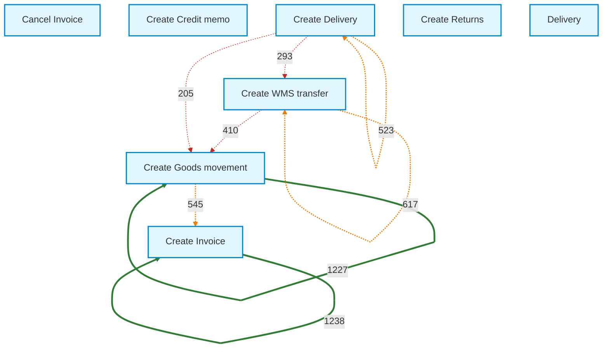
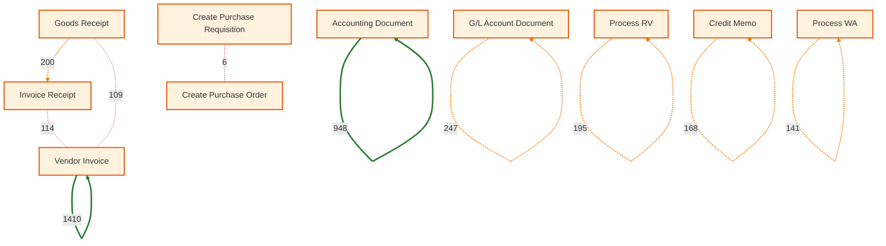

# Process Mining Diagrams

> **Data Attribution**
> Dataset: SAP IDES Demo System Event Logs
> Source: [sap-extractor](https://github.com/Agnesvgr96/sap-extractor)
> License: MIT

This page contains Mermaid flowchart diagrams showing the directly-follows relationships discovered in SAP process event logs.

## How to Read These Diagrams

- **Nodes** represent activities in the process
- **Arrows** show transitions between activities
- **Numbers on arrows** indicate how many times that transition occurred
- **Arrow styles**:
  - Solid lines with thick stroke = High frequency (most common paths)
  - Dashed lines = Medium frequency
  - Dotted lines = Low frequency

---

## Order-to-Cash (O2C) Process

The O2C process covers the flow from customer order to invoice creation.

### Statistics

| Metric | Value |
|--------|-------|
| Total events processed | 5,708 |
| Unique cases | 646 |
| Unique activities | 8 |
| Transitions shown (top 80%) | 5 |

### Process Flow Diagram

### O2C Transition Details

| From | To | Count | Frequency |
|------|-----|-------|-----------|
| Create Invoice | Create Invoice | 1,238 | **High** |
| Create Goods movement | Create Goods movement | 1,227 | **High** |
| Create WMS transfer | Create WMS transfer | 617 | Medium |
| Create Goods movement | Create Invoice | 545 | Medium |
| Create Delivery | Create Delivery | 523 | Medium |
| Create WMS transfer | Create Goods movement | 410 | *Low* |
| Create Delivery | Create WMS transfer | 293 | *Low* |
| Create Delivery | Create Goods movement | 205 | *Low* |

### O2C Process Interpretation

The diagram reveals:

1. **Self-loops dominate**: Invoice→Invoice and Goods→Goods indicate multi-line order processing
2. **Main flow**: Delivery/WMS → Goods Movement → Invoice
3. **Warehouse handling**: WMS transfers feed into goods movements
4. **Financial completion**: Invoices are the typical endpoint

---

## Procure-to-Pay (P2P) Process

The P2P process covers the flow from purchase requisition to payment.

### Statistics

| Metric | Value |
|--------|-------|
| Total events processed | 7,420 |
| Unique cases | 2,486 |
| Unique activities | 20 |
| Transitions shown (top 80%) | 13 |

### Process Flow Diagram

### P2P Transition Details

| From | To | Count | Frequency |
|------|-----|-------|-----------|
| Vendor Invoice | Vendor Invoice | 1,410 | **High** |
| Accounting Document | Accounting Document | 948 | **High** |
| G/L Account Document | G/L Account Document | 247 | Medium |
| Goods Receipt | Invoice Receipt | 200 | Medium |
| Process RV | Process RV | 195 | Medium |
| Credit Memo | Credit Memo | 168 | Medium |
| Process WA | Process WA | 141 | Medium |
| Invoice Receipt | Vendor Invoice | 114 | *Low* |
| Goods Receipt | Vendor Invoice | 109 | *Low* |
| Create Purchase Requisition | Create Purchase Order | 6 | *Low* |

### P2P Process Interpretation

The diagram reveals:

1. **Batch processing**: High self-loop counts (Vendor Invoice, Accounting Document) indicate batch posting
2. **Three-way match flow**: Goods Receipt → Invoice Receipt → Vendor Invoice shows proper matching
3. **Requisition-to-PO**: Only 6 direct transitions, indicating many POs created without PR (compliance issue)
4. **Financial documents dominate**: G/L and Accounting documents show financial recording activity

---

## Comparison: O2C vs P2P

| Aspect | O2C | P2P |
|--------|-----|-----|
| Cases | 646 | 2,486 |
| Events | 5,708 | 7,420 |
| Activities | 8 | 20 |
| Avg events/case | 8.8 | 3.0 |
| Dominant pattern | Multi-line order fulfillment | Batch financial posting |
| Primary flow | Delivery → Goods → Invoice | GR → IR → Vendor Invoice |
| Self-loops | Common (order lines) | Very common (batches) |

---

## Rendering These Diagrams

These Mermaid diagrams can be rendered in:

- **GitHub**: Automatically rendered in markdown files
- **GitLab**: Automatically rendered in markdown files
- **VS Code**: With Mermaid extension
- **Mermaid Live Editor**: [mermaid.live](https://mermaid.live/)
- **Any MCP-compatible viewer**: Supporting markdown with Mermaid

---

*Diagrams generated: January 2025*
*Dataset: SAP IDES via sap-extractor (MIT License)*
